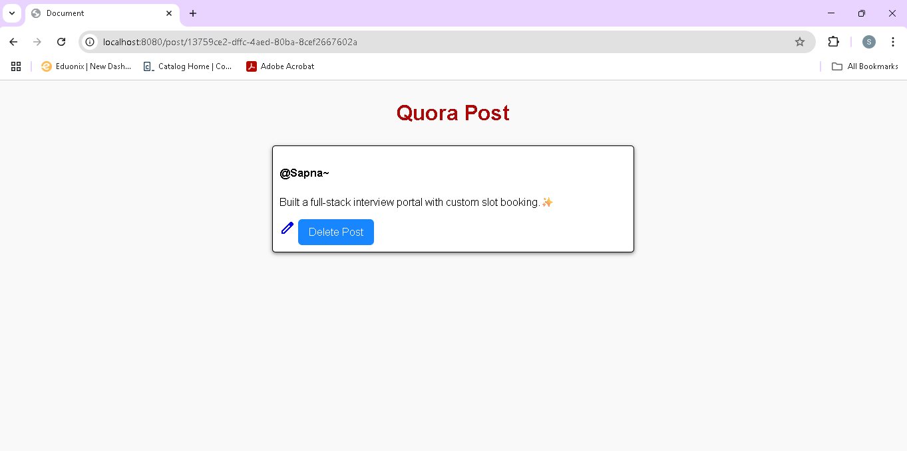
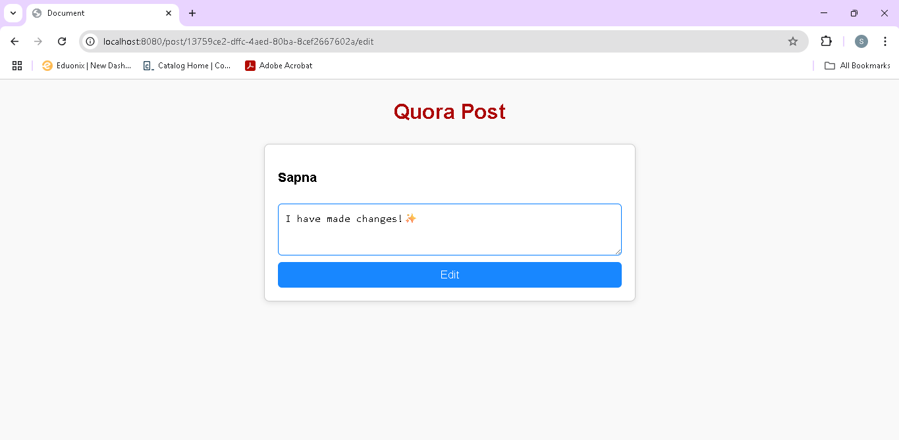
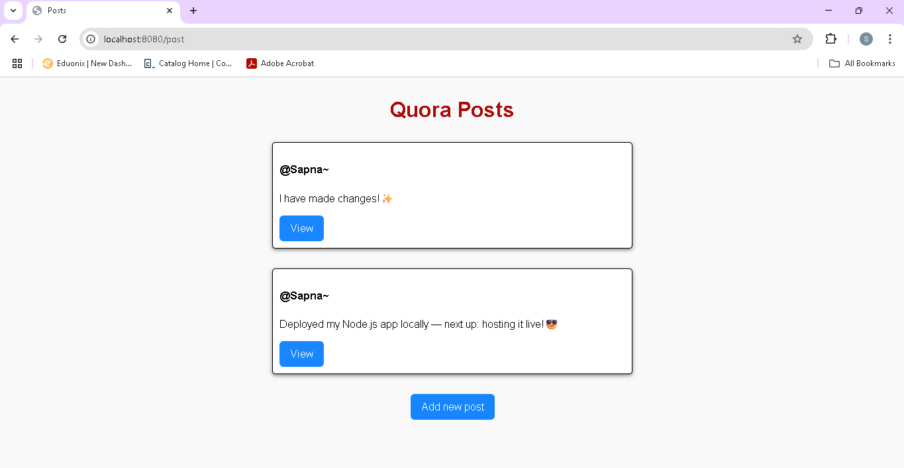

# Quora Post Clone (Basic)

This is a simple **Quora-style Post App** built using **Node.js** and **Express.js**, where posts are stored in an in-memory array (i.e., no database). It's ideal for beginners who want to understand basic routing, templating, and form handling in Express.

## 🚀 Features

- Create a post with a title and content
- View all posts in a list format
- No database required — data is stored temporarily in memory

## 🛠️ Tech Stack

- Node.js
- Express.js
- EJS (Embedded JavaScript Templates)
- HTML & CSS (Basic styling)

## 📁 Folder Structure

```
quora-post-app/
├── public/
│   └── style.css
├── views/
│   ├── home.ejs
│   ├── new.ejs
│   └── post.ejs
├── app.js
└── package.json
```

## 🔧 Installation

```bash
git clone <repo-url>
cd quora-post-app
npm install
npm start
```

Then open your browser and navigate to `http://localhost:8080`

## 📸 Screenshots






## 📝 Future Scope

- Add user authentication

- Integrate MongoDB to persist posts
- Add categories, upvotes, and comments
- Responsive UI

## 🙋‍♀️ Author

Built with ❤️ by Sapna